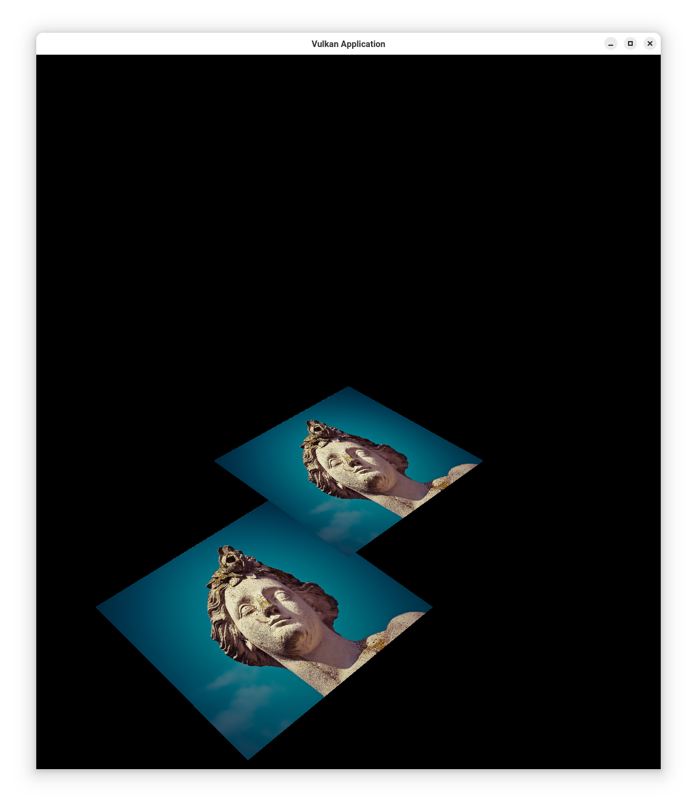

***********
VulkanDepth
***********

This application extends an object-oriented approach to the 
`Vulkan Tutorial <https://vulkan-tutorial.com/>`_ up to the section on 
Depth Buffering. In addition to the previous features, it now includes 
depth buffering to correctly render layered textures, ensuring that closer 
textures appear on top of further ones without aliasing artifacts in overlapping areas.

Overview
########

This repository serves as an advanced framework for developers building 
Vulkan-based applications with depth buffering support. Following the Vulkan 
Tutorial through texture mapping and depth buffering, it provides a foundation 
for projects requiring accurate 3D rendering with layered depth.

**Current Features:**

- **Depth Buffering:** Implements depth buffering to resolve layering and 
  overlap artifacts, ensuring correct rendering order for layered textures.
- **Texture Mapping:** Supports texture loading and sampling using Vulkan's 
  combined image samplers.
- **Uniform Buffer Objects (UBOs):** Allows real-time updates to transformation 
  matrices for view, model, and projection transformations.
- **Dynamic Rendering:** Renders rotating textured squares, with support for 
  dynamic window resizing and zoom adjustments.
  
**Additional Features:**

- **Vulkan Memory Management:** Uses Vulkan Memory Allocator (VMA) for efficient 
  memory management.
- **Command Buffers and Synchronization:** Employs single-use command buffers 
  for texture uploads and transition operations, optimizing GPU performance.
- **Error Handling with Validation Layers:** Utilizes Vulkan validation layers 
  to ensure robust debugging and error tracking.

**Limitations:**

- This version does not yet include mipmapping or multi-threaded rendering support.

**Enhanced UBO Functionality:**

- Supports per-frame updates to transformation matrices, enabling dynamic object manipulation.
- Includes view, model, and projection transformations for accurate perspective rendering.

Development Status
##################

The **VulkanTextureDepth** repository is in an active development stage, aimed 
at both educational and foundational uses. Users are encouraged to expand 
the codebase with additional features, unit testing, and thread-safety mechanisms 
as needed.

Contributing
############

This project is currently open for improvements. If you wish to contribute, 
please contact the author for authorization to submit a pull request.

License
#######

This software is distributed under the MIT license.

Requirements
############

The **VulkanTextureDepth** library is developed and tested on macOS and Arch Linux. 
It requires the following tools and versions:

- `g++ 14.1.1` or `clang 16.0.6` compiler
- `CMake 3.29.6` or later
- `valgrind` for memory checking

Installation
############

This project is available under the MIT license, allowing anyone to use or 
contribute to the codebase with the author's permission.

To use this repository, follow these steps:

1. Ensure `git` and `cmake` are installed on your system. CMake version 3.27.7 
   or later is required.

2. Clone the repository to your preferred directory:

   .. code-block:: bash

      git clone https://github.com/Jon-Webb-79/VulkanApplication.git VulkanApplication

3. Navigate to the appropriate script directory depending on your shell environment 
   (bash or zsh):

   .. code-block:: bash

      # For bash
      cd VulkanApplication/scripts/bash 
      
      # For zsh
      cd VulkanApplication/scripts/zsh 

4. Build the codebase:

   .. code-block:: bash

      # For bash
      bash debug.sh  

      # For zsh
      zsh debug.zsh

5. Navigate to `VulkanApplication/build/debug` to run the debug version:

   .. code-block:: bash

      ./VulkanApplication

6. If all unit tests pass and memory leaks are resolved, you may convert this codebase 
   into a static or dynamic library or incorporate the `.cpp` and `.hpp` files into 
   your own project.

7. To create a release version, execute the following commands from the `scripts` directory:

   .. code-block:: bash

      zsh release.zsh
      ./VulkanApplication

